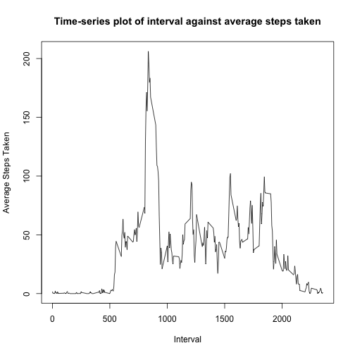
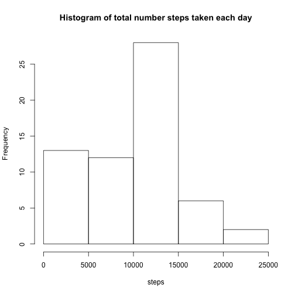
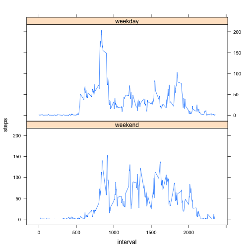

#Loading and preprocessing the data

```r
if(!file.exists("./data")) {dir.create("./data")}

if(!file.exists("./data/activity.csv")) {
        URL <- "https://d396qusza40orc.cloudfront.net/repdata%2Fdata%2Factivity.zip"
        download.file(URL,destfile="./data/repdata-data-activity.zip",method="curl")
        unzip("./data/repdata-data-activity.zip")
}

data <- read.csv("./data/activity.csv")
```


#What is mean total number of steps taken per day?
For this part of the assignment, you can ignore the missing values in the dataset.

1. Calculate the total number of steps taken per day

2. If you do not understand the difference between a histogram and a barplot, research the difference between them. Make a histogram of the total number of steps taken each day

3. Calculate and report the mean and median of the total number of steps taken per day

```r
# Total number of steps taken per day
totals <- tapply(data$steps,data$date,sum,na.rm=TRUE)
```


```r
hist(totals,main="Histogram of total number of steps taken per day",xlab="Steps")
```

 

```r
# Calculate and report the mean and median of the total number of steps taken per day
meanStepsPerDay <- mean(totals)
medianStepsPerDay <- median(totals)
```
* The mean of the total number of steps taken per day is 9354.23.

* The median of the total number of steps taken per day is 10395.


#What is the average daily activity pattern?
1. Make a time series plot (i.e. type = "l") of the 5-minute interval (x-axis) and the average number of steps taken, averaged across all days (y-axis)

2. Which 5-minute interval, on average across all the days in the dataset, contains the maximum number of steps?


```r
#time series plot interval (x-axis) and average number of steps, averaged across all days (y-axis)
averageSteps <- aggregate(steps ~ interval,data,mean)

plot(averageSteps$interval,averageSteps$steps,type='l',main="Time-series plot of interval against average steps taken",xlab="Interval",ylab="Average Steps Taken")
```

 


```r
maxInterval <- which.max(averageSteps$steps)
```
The 5-minute interval that contains the maximum number of steps (on average) is interval 835, with an average of 206.1698113 steps.


#Inputting missing values

Note that there are a number of days/intervals where there are missing values (coded as NA). The presence of missing days may introduce bias into some calculations or summaries of the data.

1. Calculate and report the total number of missing values in the dataset (i.e. the total number of rows with NAs)

2. Devise a strategy for filling in all of the missing values in the dataset. The strategy does not need to be sophisticated. For example, you could use the mean/median for that day, or the mean for that 5-minute interval, etc.

3. Create a new dataset that is equal to the original dataset but with the missing data filled in.

4. Make a histogram of the total number of steps taken each day and Calculate and report the mean and median total number of steps taken per day. Do these values differ from the estimates from the first part of the assignment? What is the impact of imputing missing data on the estimates of the total daily number of steps?


```r
# Total number of missing values
missingValues <- sum(is.na(data))
```
* The number of rows with missing values is 2304.


###My missing value strategy:
For my strategy for filling in all of the missing values in the dataset, I have decided to use the mean for each 5-minute interval. This is done with a simple for-loop to go through each row in the (new) dataframe, if the steps value is NA, it will pick the average steps for that interval and replace the value.


```r
filledDF <- data

for(row in 1:nrow(filledDF)) {
        if(is.na(data[row,'steps'])) {
                filledDF[row,'steps'] <- averageSteps[averageSteps$interval==data[1,'interval'],'steps']
        }
}
```


```r
filledTotals <- aggregate(steps ~ date, filledDF, sum)

hist(filledTotals$steps,main="Histogram of total number steps taken each day",xlab="steps")
```

 

```r
filledMean <- mean(filledTotals$steps)
filledMedian <- median(filledTotals$steps)
```

* The mean of the total number of steps taken per day is now 9419.08073.

* The median of the total number of steps taken per day is now 1.0395 &times; 10<sup>4</sup>.

###Effects of inputting missing data
* The mean is very close to the original mean in the first part of this assignment. The mean and the median are now very close together, median has decreased.

* Inputting the missing data has caused the total daily number of steps to increase (for those days in which there were some missing values, obviously).


#Are there differences in activity patterns between weekdays and weekends?
For this part the weekdays() function may be of some help here. Use the dataset with the filled-in missing values for this part.

1. Create a new factor variable in the dataset with two levels – “weekday” and “weekend” indicating whether a given date is a weekday or weekend day.

2. Make a panel plot containing a time series plot (i.e. type = "l") of the 5-minute interval (x-axis) and the average number of steps taken, averaged across all weekday days or weekend days (y-axis). See the README file in the GitHub repository to see an example of what this plot should look like using simulated data.


```r
library(lattice)

dayNames <- weekdays(as.POSIXlt(filledDF$date))

day <- factor(
    ifelse(dayNames %in% c("Saturday","Sunday"),"weekend","weekday"),
    levels=c("weekend","weekday"))

filledDF2 <- cbind(filledDF,day)

splitDF <- aggregate(steps ~ interval + day, filledDF2, mean)

# create the panel plot
plot<-xyplot(steps ~ interval | day, data = splitDF, layout=c(1,2), type='l')

print(plot)
```

 
